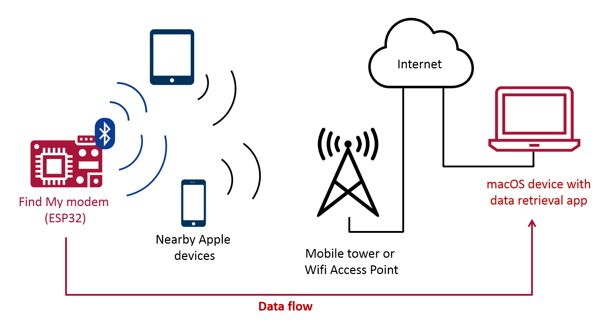
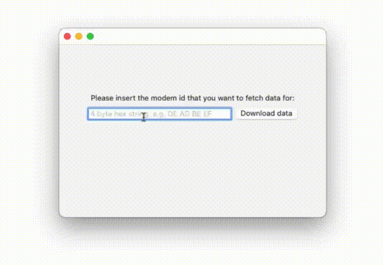

# Send My

Send My allows you to upload abritrary data from devices without an internet connection by (ab)using Apple's Find My network. The data is broadcasted via Bluetooth Low Energy and forwarded by nearby Apple devices.

The application consists of two parts:
- Firmware: An ESP32 firmware that turns the microcontroller into a serial (upload only) modem
- DataFetcher: A macOS application used to retrieve, decode and display the uploaded data

Both are based on [OpenHaystack](https://github.com/seemoo-lab/openhaystack), an open source implementation of the Find My Offline Finding protocol.

# How it works

Summary: When sending, the data is encoded in the public keys that are broadcasted by the microcontroller. Nearby Apple devices will pick up those broadcasts and forward the data to an Apple backend as part of their location reporting. Those reports can later be retrieved by any Mac device to decode the sent data.

Check https://positive.security/blog/send-my for details.

# How to use

## The Modem

1. Change the `modem_id` (and if desired the `data_to_send` default message)
2. Check [the Firmware README.md](Firmware/ESP32/README.md) for flashing instructions
3. After boot, the ESP32 will immediately broadcast the default message in a loop until a new message is received via the serial interface. Messages can be sent to the modem e.g. using the Arduino IDE's Serial Monitor.

## The DataFetcher

1. Install OpenHaystack including the AppleMail plugin as explained in https://github.com/seemoo-lab/openhaystack#installation
2. Run OpenHaystack and ensure that the AppleMail plugin indicator is green
3. Run the DataFetcher OFFetchReport application (either the Release version or build it yourself by opening `DataFetcher/DataFetcher.xcodeproj` in XCode and running the OFFetchReport target)
4. Insert the 4 byte `modem_id` previously set in the ESP firmware as hex digits
5. Fetch uploaded messages

# References

- Blog Post: https://positive.security/blog/send-my
- OpenHaystack: https://github.com/seemoo-lab/openhaystack
- Alexander Heinrich, Milan Stute, Tim Kornhuber, Matthias Hollick. Who Can Find My Devices? Security and Privacy of Apple's Crowd-Sourced Bluetooth Location Tracking System. Proceedings on Privacy Enhancing Technologies (PoPETs), 2021.

# License

Send My is licensed under the GNU Affero General Public License v3.0.
